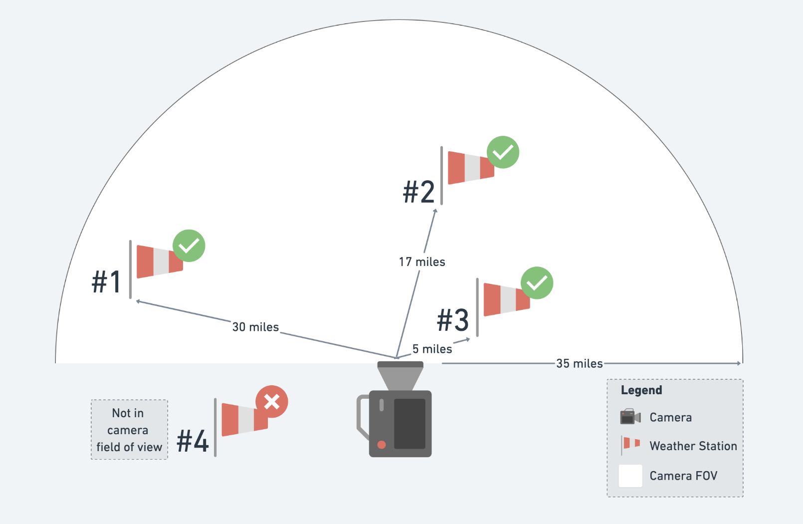

# Weather Notebooks

## Getting Started

1. Create a copy of `config.json.example` and remove the `.example`

2. Update the `synoptic_api_token` value

In `config.json`:

- weather_neworks format:

```
# from synoptic api
network_id: SHORTNAME
```

- weather_datetime format:

```
YYYYmmddHHMM
```

## Approach

The weather notebooks provided aim to...
- retrieve relevant weather station metadata
- map weather stations to cameras
- for the mapped weather stations, retrieve the weather data available within the configured timeframe
- for each camera, aggregate the weather values for each interval




## Weather Attributes Used

- temperature
- humidity
- wind speed
- wind direction
- wind gust
- dew point temperature
- derived u component of wind speed/direction
- derived v component of wind speed/direction

## Comments

All datetimes from synoptic mesonet API have been set to be returned in UTC in the request.